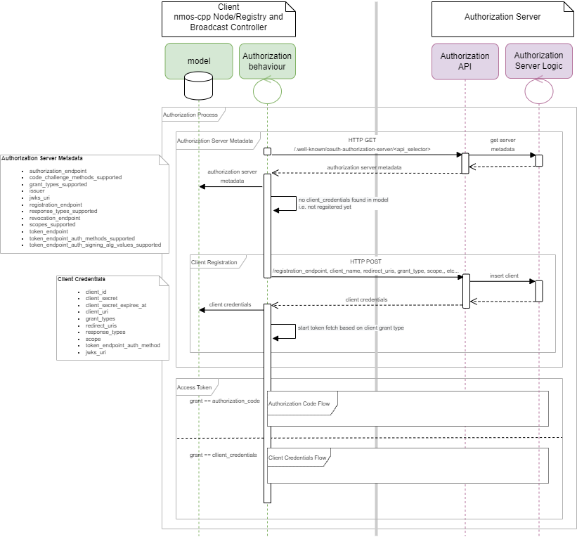

# Architecture of nmos-cpp

The [nmos](../Development/nmos/) module fundamentally provides three things.

1. A C++ data model for the AMWA IS-04, IS-05 and IS-08 NMOS resources which represent the logical functionality of a Node, or equally, for the resources of many Nodes held by a Registry.
2. An implementation of each of the REST APIs defined by the AMWA IS-04, IS-05, IS-08, IS-09 and IS-10 NMOS specifications, in terms of the data model.
3. An implementation of the Node and Registry "active behaviours" defined by the specifications.

The module also provides the concept of a server which combines the REST APIs and behaviours into a single object for simplicity.

## Data Model

> [nmos/model.h](../Development/nmos/model.h)

The top-level data structures for an NMOS Node and Registry are ``nmos::node_model`` and ``nmos::registry_model`` respectively.

A ``node_model`` has four member variables which are containers, of IS-04 resources, IS-05 resources, IS-07 resources and IS-08 resources, respectively:

```C++
nmos::resources node_resources;
nmos::resources connection_resources;
nmos::resources events_resources;
nmos::resources channelmapping_resources;
```

A ``registry_model`` has two containers, this time for the Registry's own Node API "self" resource, and for the resources that have been registered with the Registration API:

```C++
nmos::resources node_resources;
nmos::resources registry_resources;
```

It also has a single resource for the IS-09 System API global configuration resource for when the registry is also serving this purpose:

```C++
nmos::resource system_global_resource;
```

In addition, both models, by inheritance from ``nmos::base_model``, include member variables to hold application-wide settings and shutdown state, and to perform synchronisation between multiple threads that need shared access to the data model.

### Resources Container

>  [nmos/resources.h](../Development/nmos/resources.h)

The ``nmos::resources`` container can be viewed similarly to a C++ Standard Library container class template like a ``std::map``, but it provides multiple indices required for the IS-04 APIs, namely:

* by id
* by type (node, device, source, flow, sender, receiver)
* by creation timestamp
* by update timestamp

Each index has the necessary constraints to maintain the invariants required by the NMOS specifications, while providing the required ordering and look-up operations.

The [Boost Multi-index Containers Library](https://www.boost.org/doc/libs/1_68_0/libs/multi_index/doc/index.html) is used to implement the ``resources`` container, but a higher-level API is provided by free functions including:

* ``nmos::insert_resource``
* ``nmos::modify_resource``
* ``nmos::erase_resource``
* ``nmos::find_resource``

Unlike a ``std::map``, each of the indices of the ``resources`` container are based on the relevant member variables of the contained elements, that is the resources themselves, as represented by the ``nmos::resource`` data structure.

### Resource

> [nmos/resource.h](../Development/nmos/resource.h)

An ``nmos::resource`` is primarily designed to represent the resources defined by the AMWA IS-04 specification.
A ``resource`` is constructed from a triplet of its API specification version, its resource type and the JSON representation of the resource data (which includes its unique id).

In addition to these data, a ``resource`` maintains several items of metadata, including the unique id of each of its sub-resources (for performance), the created and updated timestamps (for Query API ordering) and the resource health (for Registration API expiry).

### Synchronisation

> [nmos/model.h](../Development/nmos/model.h),
> [nmos/mutex.h](../Development/nmos/mutex.h)

The implementation of the REST APIs utilises the C++ REST SDK, which provides task-based concurrency for HTTP request handling via a thread pool.
In addition, the "active behaviours" of a Node or Registry are implemented by long-running threads.

Protecting the shared data model from being simultaneously accessed by multiple threads is thus critical. The ``base_model`` contains a mutex, which offers two levels of access:

* shared - several threads can share ownership of the same mutex
* exclusive - only one thread can own the mutex

Shared access is used to allow multiple threads to simultaneously _read_ the data model, provided no thread currently has exclusive access.
Exclusive access is used to allow a single thread to _write_ to the data model, preventing any threads from reading while the write operation is being performed.
Convenience member functions provide simple scoped locking of the mutex as follows:

```C++
auto lock = model.read_lock(); // takes a shared lock, blocks until the mutex is available
auto lock = model.write_lock(); // takes an exclusive lock, blocks until the mutex is available
```

In order to provide simple synchronisation between multiple threads, the ``base_model`` also contains a condition variable that any thread may use to block until another thread makes a change to the data model.

> **NOTE:** It is of course critical that any thread that modifies the data model does so only after gaining exclusive access via a write lock _and_ that it then uses the condition variable to notify waiting threads once its write operation is complete.

A convenience member function ``notify`` is provided to notify all threads waiting on the model's condition variable.
Convenience ``wait`` member function templates provide a simple means to block the current thread until the condition variable is notified or a spurious wakeup occurs, optionally looping until some predicate is satisfied.
For example:

```C++
auto lock = model.read_lock();
auto most_recent_update = nmos::tai_min();
for (;;)
{
    // wait for the thread to be interrupted because there have been updates to the model
    // or because the server is being shut down
    model.wait(lock, [&] { return model.shutdown || most_recent_update < nmos::most_recent_update(model.connection_resources); });
    if (model.shutdown) break;
    ...
}
```

## REST APIs

> [nmos/node_api.cpp](../Development/nmos/node_api.cpp),
> [nmos/connection_api.cpp](../Development/nmos/connection_api.cpp),
> [nmos/events_api.cpp](../Development/nmos/events_api.cpp),
> [nmos/registration_api.cpp](../Development/nmos/registration_api.cpp),
> [nmos/query_api.cpp](../Development/nmos/query_api.cpp),
> [nmos/system_api.cpp](../Development/nmos/system_api.cpp),
> [nmos/channelmapping_api.cpp](../Development/nmos/channelmapping_api.cpp)
> [nmos/authorization_redirect_api.cpp](../Development/nmos/authorization_redirect_api.cpp)

The ``nmos`` module also provides the implementation of each of the REST APIs defined by AMWA IS-04, IS-05, IS-07, IS-08, IS-09 and IS-10.

The C++ REST SDK provides a general purpose HTTP listener, that accepts requests at a particular base URL and passes them to a user-specified request handler for processing.
Therefore the ``nmos`` module implements each API as a request handler which reads and/or writes the relevant parts of the NMOS data model, and provides a convenience function, ``nmos::support_api``, for associating the API request handler with the HTTP listener.

For example, a simple configuration of the Connection API would look like:

```C++
auto connection_api = nmos::make_connection_api(node_model, gate);
web::http::experimental::listener::http_listener connection_listener(connection_uri);
nmos::support_api(connection_listener, connection_api);
```

As mentioned previously, the C++ REST SDK ``http_listener`` handles requests using task-based concurrency via a thread pool. The listener must be opened before any request will be accepted; the RAII idiom may be used to open and close the listener:

```C++
web::http::experimental::listener::http_listener_guard connection_guard(connection_listener);
```

Each specific endpoint, or route, defined by the RAML definition of the API in the NMOS specification, is implemented as a function object within the relevant C++ factory function, such as ``nmos::make_connection_api`` in the example above.
Each endpoint function takes the request and response objects, and returns a ``task`` object that becomes ready when the handler is finished, and the response is ready to send, or the next handler should be called.
This allows requests to be processed in parallel and without blocking the thread pool.

(The ``gate`` seen in the above example is the Logging Gateway through which log messages are sent for processing. Logging is discussed below.)

## Active Behaviour

The REST APIs of the ``nmos`` module can be viewed as "passive" or "reactive" in the sense that they are driven only by HTTP requests.
The AMWA IS-04 and IS-05 specifications also define the "active" or "proactive" behaviours that are required of Node and the Registry implementations.

The ``nmos`` module implements these behaviours as long-running threads that interact with the NMOS data model.

(Both the **nmos-cpp-node** simulated Node, and the **nmos-cpp-registry** Registry application, of course also have a ``main`` thread. After set-up this simply blocks waiting for a shutdown signal from the user.)

### Node Behaviour

> [nmos/node_behaviour.cpp](../Development/nmos/node_behaviour.cpp),
> [nmos/connection_activation.cpp](../Development/nmos/connection_activation.cpp)

The required Node behaviour includes:

- discovery and registration of the Node's resources with a Registry
- persistence of its resources in the registry by issuing heartbeats
- updating of registrations for existing resources in response to changes in the data model

The state machine implemented by the ``nmos::node_behaviour_thread`` is shown below:


<details>
<summary>More details...</summary>

Notes:

- in **Registered Operation**, "POST sub-resources" is short-hand for queuing up resource-added events for all the sub-resources on the transition from the **Initial Registration** state
- the exponential backoff is not described
- "(5xx) Error" also covers connectivity issues, timeouts
- HTTP response status codes that are not explicitly mentioned do not cause a state transition

</details>

In addition, the ``nmos::connection_activation_thread`` manages scheduling of Connection API activation requests. It supports callbacks that allow vendor-specific customization of the behaviour.

#### Vendor-specific Node Behaviour

> [nmos-cpp-node/node_implementation.cpp](../Development/nmos-cpp-node/node_implementation.cpp)

It is a principle of both AMWA IS-04 and IS-05 that the resources exposed by the APIs should reflect the current configuration of the underlying implementation.

It is therefore expected that a Node implementation using **nmos-cpp** will contain one or more additional threads that synchronise the NMOS data model with the underlying state.
At any time, such a thread may make changes to the model to reflect events in the underlying implementation, provided it correctly locks the model mutex and notifies the condition variable.
It may also wait to be notified of changes in the data model, for example, as a result of Connection API activation requests.
The example ``node_implementation_thread`` demonstrates how such a thread might behave.
Example implementation-specific callbacks to customize how the Node API and Connection API process requests are also included.

### Registry Behaviour

> [nmos/query_ws_api.cpp](../Development/nmos/query_ws_api.cpp),
> [nmos/registration_api.cpp](../Development/nmos/registration_api.cpp)

The required Registry behaviour includes:

- push notification of changes in the Registry via Query API WebSockets
- expiry of a Node's resources after the specified garbage collection interval if no heartbeats are received from that Node

These functions are implemented by ``nmos::send_query_ws_events_thread`` and ``nmos::erase_expired_resources_thread`` respectively.

The diagram below shows a sequence of events within and between an **nmos-cpp** Node, the **nmos-cpp-registry** Registry and a Client.
Resource events initiated in a resource-scheduling thread in the Node are propagated via the Registration API to the Registry model.
Events in the Registry model are sent in WebSocket messages to each Client with a matching Query API subscription.


## Servers

> [nmos/node_server.cpp](../Development/nmos/node_server.cpp),
> [nmos/registry_server.cpp](../Development/nmos/registry_server.cpp)

The ``nmos`` module also provides factory functions to create NMOS Node servers and NMOS Registry servers, which combine the REST APIs and behaviours into a single object for simplicity.

For example, a simple configuration of a Node supporting the Node API, Connection API, Events API, etc. would look like:

```C++
auto node_server = nmos::experimental::make_node_server(node_model, node_implementation_resolve_auto, node_implementation_set_transportfile, log_model, gate);
nmos::server_guard node_server_guard(node_server);
```

## Logging

> [slog/all_in_one.h](../Development/slog/all_in_one.h)

Logging is a mundane but important feature of production software. Slog is a library for logging or tracing in C++. Most logging statements in **nmos-cpp** look a bit like this:

```C++
slog::log<slog::severities::warning>(gate, SLOG_FLF) << "Beware the Jabberwock, my son!";
slog::log<slog::severities::info>(gate, SLOG_FLF) << "A picture is worth " << 1000 << " words.";
```

These logging statements can be easily disabled at compile-time (via the ``SLOG_LOGGING_SEVERITY`` preprocessor symbol) or at run-time, controlled by the specified logging gateway.

(The compile-time level used by the nmos-cpp apps can be configured via CMake.
Set the value of the CMake variable ``SLOG_LOGGING_SEVERITY`` to ``slog::never_log_severity`` to strip all logging at compile-time, or ``slog::max_verbosity`` for full control at run-time.)

Most top-level functions in the ``nmos`` module have a Logging Gateway as a final parameter. All log messages will be sent through the specified gateway.

(Both the **nmos-cpp-node** simulated Node, and the **nmos-cpp-registry** Registry application, have a ``main_gate`` logging gateway.
This can be configured to write error messages in a plain text file format, to also write an access log in the [Common Log Format](https://httpd.apache.org/docs/2.4/logs.html#accesslog)
also used by the Apache HTTP Server and others, and to expose recent log messages via a JSON-based REST API in the same style as the NMOS Query API.
Both applications also allow the logging verbosity to be changed at run-time - up to the compile-time level.
See the [Tutorial](Tutorial.md) and the provided [nmos-cpp-node/config.json](../Development/nmos-cpp-node/config.json) and [nmos-cpp-registry/config.json](../Development/nmos-cpp-registry/config.json) files for more information.)

<details>
<summary>More details...</summary>

In full, a ``slog`` logging statement may specify:

- the logging gateway that it uses
- its severity/verbosity level
  - this enables the logging statement to be almost entirely disabled at compile-time ("compiled out") if necessary
- any conditions that would make the log message irrelevant, such as intermittent ("1-in-N") logging statements
- a minimal set of logging attributes whose values can always be captured cheaply and only be captured right there (source filename, line number, function name/signature)
- the message itself, using stream-based or ``printf``-style message preparation

A logging statement at run-time:

- checks conditions that would make the log message irrelevant, and if not:
  - uses the logging gateway to decide if the log message will be pertinent, and if so:
    - constructs the log message with the logging attributes
    - prepares the message itself, including any additional statement-specific attributes (e.g. event id/error code, category)
    - sends the prepared message through the logging gateway
  - terminates the application if its severity level is fatal

</details>

## Authorization

This is based on the ``OAuth 2.0`` recommendation, it is used for protecting the NMOS APIs, which allows NMOS Node and NMOS Registry to give limited access to the third-party application. Third-party applications including Broadcast Controller, which queries Registry via the AMWA IS-04 for the NMOS Nodes information and issues the IS-05 connection to the Nodes. NMOS Nodes also act as the third-party for the Registry to perform the AMWA IS-04 node registration.

### General idea of how it works

A client such as Broadcast Controller provides credentials to the Authorization Server. The required access token(s) is then granted to the Controller for accessing the protected APIs on the Resource(s) Server, such as the NMOS Node. The Resource Server will verify the access token for the level of the access right. If all goes well, the protected API is accessible.

The access token is time-limited, it must be refreshed before it expired. It is recommended to attempt a refresh at least 15 seconds before the expiry or the half-life of the access token.

To speed up the token validation process, the Resource(s) Server periodically fetches the Authorization Server's public keys, typically once every hour. The public keys allow the Resource(s) Server to perform local token validation without bombarding the Authorization Server on every API access validation.

A similar idea is also applied to how NMOS Node performs node registration. Registry obtains the public keys from the Authorization Server, and the Node obtains the registration access token from the Authorization Server. The Node embeds the token into the registration request for node registration, and registry heartbeat.

### Authorization Server Metadata

Clients, such as NMOS Broadcast Controller, Registry and Node locate the Authorization API endpoints via the DNS-SD Authorization Server discovery. The Authorization Server has a well-known endpoint for returning the server metadata. Details are shown in the client registration sequence diagram.

### Client Registration

Clients must be registered to the Authorization Server before using the ``OAuth 2.0`` protocol. In the event of successful registration, the Authorization Server will return the client_id for the public client and client_id and client_secret for the confidential client. It is, however, important that the public client which is using the Authorization Code Flow must register one or more redirect URLs for security purposes, which allows Authorization Server to ensure any authorization request is genuine and only the valid redirect URLs are used for returning the authorization code. While using Client Credentials Flow, Private Key JWT can be used for client authentication with extra security.

See the client registration sequence diagram below on how an NMOS Node is registered to the Authorization Server.



### Access Token

There are a number of ways to request the access token, it is based on the type of authorization grant. The grant type depends on the location and the nature of the client involved in obtaining the access token. A number of grant types are defined in ``OAuth 2.0``.  NMOS is focused on using the following types, the ``Authorization Code Grant`` and the ``Client Credentials Grant``.

#### Authorization Code Grant

This is the most recommended type, it should be used if the client has a web browser, such as the Broadcast Controller. An Authorization code is returned by the Authorization Server via the client's redirect URI. The client can then exchange it for a time-limited access token, and renew it with the refresh token.

For public clients, there is a potential security risk with an attacker hijacking the Authorization code. To prevent that ``Proof Key for Code Exchange`` (PKCE) is used to further secure the Authorization Code Flow.

Step 1. create a high entropy cryptographic random string, ``code_verifier``.

Step 2. convert the ``code_verifier`` to ``code_challenge`` with the following logic:

```
code_challenge=BASE64URL-ENCODE(SHA256(ASCII(code_verifier)))
```

Step 3. includes the ``code_challege`` and the hashing method used to generate the ``code_challenge`` in the authorization code request.

Step 4. send the ``code_verifier`` and the ``authorization code`` for exchanging the token. The Authorization Server uses the ``code_verifier`` to recreate the matching ``code_challenge`` to verify the client.


#### Client Credentials Grant

This type of authorization is used by clients to obtain the access token without user authorization, such as a hardware NMOS Node which has no web browser supported. To gain extra security the ``Private Key JWT`` is used by the NMOS Node as a form of client authentication by the Authorization Server before handing out the token.


### Authorization Server Public Keys

The public keys are used by the Resource(s) Server for validating the access token before giving access right to it's protected APIs. The client must periodically poll the Authorization Server's ``public keys``, typically once every hour. In the event, that the Authorization Server is no longer available, the last fetched public keys will be kept in use until the Authorization Server connection is restored.

The token validation is done by re-generating the matching token signature by signing the token header and the token payload.


### Authorization behaviour

> [nmos/authorization_behaviour.cpp](../../Development/nmos/authorization_behaviour.cpp)

The required Authorization behaviour includes:

- discovery of the Authorization Server
- fetch Authorization Server metadata for Authorization Server endpoints and supported features
- Authorization client registration
- fetch Authorization Server public keys
- fetch Bearer token for accessing protected endpoints

The state machine implemented by the ```nmos::experimental::authorization_behaviour_thread``` is shown below:


### Missing public keys to validate the access token

> [nmos/authorization_handlers.cpp](../../Development/nmos/authorization_handlers.cpp)
> [nmos/authorization_behaviour.cpp](../../Development/nmos/authorization_behaviour.cpp)

If no matching public key is available to validate the incoming access token. The validation handler will trigger the authorization token issuer thread to fetch and cache the public keys from this token's issuer, which will then be possible to validate any token issued by this issuer.

The state machine implemented by the ```nmos::experimental::validate_authorization_handler``` and the ```nmos::experimental::authorization_token_issuer_thread``` are shown below:


### OAuth 2.0 Node Registration Example

Following is an overview of how an ``OAuth 2.0`` NMOS Node registers to an ``OAuth 2.0`` enabled NMOS Registry.


In addition, if the Authorization behaviour thread is excluded, the NMOS Node/Registry can easily be configured as a headless ``OAuth 2.0`` enabled device. Where the access token will be fed in externally via the ```nmos::experimental::get_authorization_bearer_token_handler``` callback and the access token validation will be happening on the ```nmos::experimental::validate_authorization_token_handler``` callback.
