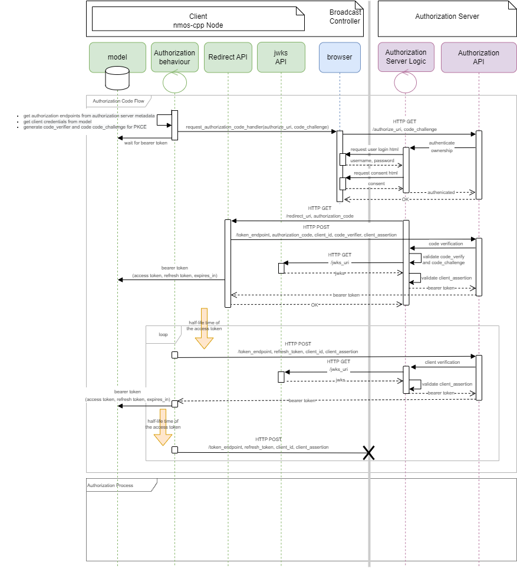
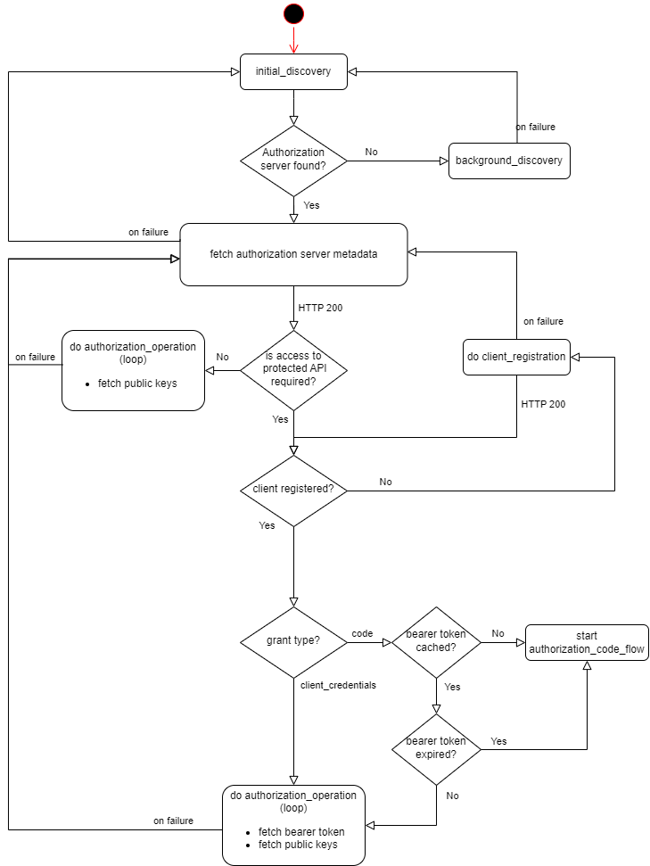

# Authorization in nmos-cpp

Authorization in nmos-cpp is based on the IS-10 / BCP-003-02 specifications, which are themselves based on _OAuth 2.0_. Authorization allows NMOS Nodes and Registries to protect APIs by limiting their access by third-party applications. Third-party applications might include Broadcast Controllers and other Nodes accessing NMOS APIs such as IS-04 and IS-05.

## Overview

A client such as a Broadcast Controller provides credentials to the Authorization Server. The Authorization Server grants the required access token(s) to the Controller for accessing protected APIs on NMOS Node(s). A Node will verify that the access token has the necessary access rights, and once successfully verified will allow access to that API.

The access token is time-limited, and must be refreshed before it expires. It is recommended to attempt to refresh the token at least 15 seconds before its expiry, or at the half-life of the access token.

To speed up the token validation process, the Node periodically fetches the Authorization Server's public keys, typically once every hour. The public keys allow the Node to perform local token validation without having to bombard the Authorization Server every time an API is accessed.

A similar idea is also applied to how Nodes perform node registration. The Registry obtains the public keys from the Authorization Server, and the Node obtains the registration access token from the Authorization Server. The Node embeds the token into the registration request for Node registration, and Registry heartbeats.

## Client Registration

In this context the term Client is used to refer to clients of the Authorization Server.  In this way Broadcast Controllers, Registries and Nodes are all referred to as Clients.

Clients locate the Authorization Server's API endpoints via DNS-SD. The Authorization Server has a well-known endpoint for returning server metadata.

Clients must be registered to the Authorization Server before using the _OAuth 2.0_ protocol. In the event of successful registration, the Authorization Server will return the `client_id` for a public client and `client_id` and `client_secret` for a confidential client. 

However, it is important that a public client which is using the Authorization Code grant register one or more redirect URLs for security purposes. These allow the Authorization Server to ensure any authorization request is genuine and only valid redirect URLs are used for returning authorization codes. While using Client Credentials grant, _Private Key JWT_ can be used in client authentication for extra security.

See the client registration sequence diagram below on how a Node is registered to the Authorization Server.


## Access Token

There are two ways of requesting access tokens from the Authomrization Server according to the type of authorization grant used. The grant type depends on the location and the nature of the Client involved in obtaining the access token.

A number of grant types are defined in _OAuth 2.0_, but the IS-10/BCP-003-02 specifications focus on using the following grant types:
- Authorization Code Grant.
- Client Credentials Grant.

### Authorization Code Grant

This is the recommended grant type and should be used if the Client runs within a web browser (for instance a Broadcast Controller). An authorization code is returned by the Authorization Server via the Client's redirect URI. The Client can then exchange this code for a time-limited access token, which can be renewed with the refresh token.

For public clients, there is a risk of an attacker hijacking the authorization code. To prevent this _Proof Key for Code Exchange_ (PKCE) is used to further secure the Authorization Code grant.

The PCKE steps are:

Step 1. Create a high entropy cryptographic random string, ``code_verifier``.

Step 2. Convert the ``code_verifier`` to ``code_challenge`` with the following logic:

```
code_challenge=BASE64URL-ENCODE(SHA256(ASCII(code_verifier)))
```

Step 3. Include the ``code_challenge`` and the hashing method used to generate the ``code_challenge`` in the authorization code request.

Step 4. Send the ``code_verifier`` and the ``authorization code`` in exchange for the token. The Authorization Server uses the ``code_verifier`` to recreate the matching ``code_challenge`` to verify the client.



### Client Credentials Grant

This type of authorization is used by Clients to obtain the access token without user interaction. This is for use by Nodes with no user interface.

For extra security the Node uses _Private Key JWT_ to authenticate with the Authorization Server when requesting the access token.


## Authorization Server Public Keys

Public keys are used by the Node for validating the access token before allowing access to its protected APIs. The Client must periodically poll the Authorization Server for its public keys, typically once every hour. In the event that the Authorization Server is no longer available, the last fetched public keys will be kept in use until the Authorization Server connection is restored.

Token validation is done by regenerating the matching token signature.  This is done by signing the token header and the token payload.


## Authorization Behaviour

> [nmos/authorization_behaviour.cpp](../../Development/nmos/authorization_behaviour.cpp)

The required Authorization behaviour includes:

- Discovery of the Authorization Server.
- Fetch Authorization Server metadata for Authorization Server endpoints and supported features.
- Authorization Client registration.
- Fetch Authorization Server public keys.
- Fetch Bearer token for accessing protected endpoints.

The state machine implemented by the ```nmos::experimental::authorization_behaviour_thread``` is shown below:



## Validating Access Tokens When Public Keys Are Missing

> [nmos/authorization_handlers.cpp](../../Development/nmos/authorization_handlers.cpp)
> [nmos/authorization_behaviour.cpp](../../Development/nmos/authorization_behaviour.cpp)

If no matching public key is available to validate the incoming access token the validation handler will trigger the authorization token issuer thread to fetch and cache the public keys from this token's issuer, which can then be used to validate any token issued by this issuer.

The state machine implemented by the ```nmos::experimental::validate_authorization_handler``` and the ```nmos::experimental::authorization_token_issuer_thread``` are shown below:


In addition, if the Authorization behaviour thread is excluded, the Node/Registry can easily be configured as a headless _OAuth 2.0_ enabled device.

In this case the access token will be fed in externally via the ```nmos::experimental::get_authorization_bearer_token_handler``` callback and the access token validation will be happening on the ```nmos::experimental::validate_authorization_token_handler``` callback.

## OAuth 2.0 Node Registration Example

The following is an overview of how an _OAuth 2.0_ Node registers to an _OAuth 2.0_ enabled Registry.


