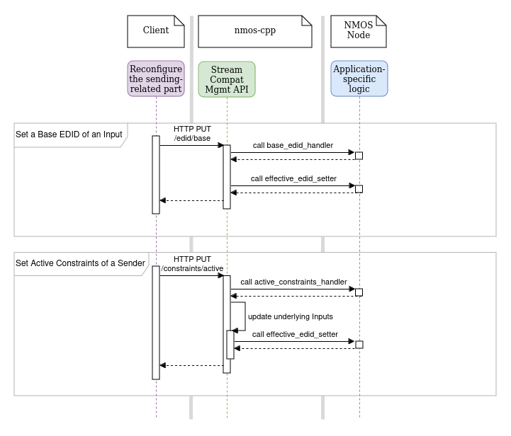
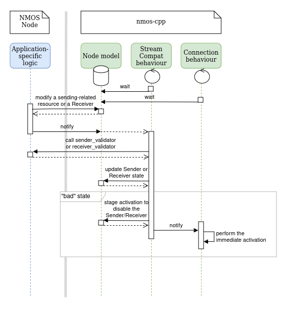

# Stream Compatibility Management implementation in nmos-cpp

``nmos-cpp`` provides three means of control over application-specific Stream Compatibility Management implementation behaviour:
- callback functions being called on client requests to the Stream Compatibility Management API
- callback functions being called on NMOS resource updates in ``node_model``
- internal JSON properties of ``streamcompatibility_resources`` that are not shown to a client

## Callbacks for client request handling

``streamcompatibility_`` prefix in callback type names here and below is omitted for brevity (e.g. ``base_edid_handler``, cf. ``streamcompatibility_base_edid_handler``).

See the sequence diagram below on how a Node uses these callbacks.

### base_edid_handler

Callback input parameters:
- an Input ID
- an Optional of a Base EDID

Callback output parameters:
- a boolean result is returned along with the error string
- this callback should not throw exceptions

``base_edid_handler`` notifies application-specific code about a Base EDID modification request (``PUT`` and ``DELETE`` operations).

It's expected to throw on ``PUT`` in order to indicate failures (e.g. an EDID validation failure).

Since ``nmos-cpp`` doesn't parse EDID, the reference implementation of this callback violates the spec because it doesn't reject invalid EDIDs. Production implementations using IS-11 Inputs with Base EDID support must replace the reference callback with an EDID-aware one.

### effective_edid_setter

Callback input parameters:
- an Input ID

Callback output parameters:
- a Variant of an Effective EDID or an href to it

``effective_edid_setter`` demands application-specific code to set Effective EDID of a specific Input when it may be required. These cases are:
- a client requested a Base EDID modification (``PUT`` or ``DELETE``)
- a client requested modification of Active Constraints of some Sender (``PUT`` or ``DELETE``) that has this Input in its list of Inputs

It's expected to never throw.

### active_constraints_handler

Callback input parameters:
- a Sender resource
- requested Constraint Sets

Callback output parameters:
- a Boolean indicating whether the device can adhere to the requested Constraint Sets with the error string
- intersections of all combinations of each of the requested Constraint Sets and each of the Constraint Sets that describe the internal device capabilities
- this callback should not throw exceptions

``active_constraints_handler`` notifies application-specific code about Active Constraints modification request (``PUT`` and ``DELETE`` operations).

It's expected to throw in order to indicate failures.

## Callbacks for node_model update handling

[IS-11](https://specs.amwa.tv/is-11/) introduces Sender and Receiver states and has normative language on disabling Senders and Receivers in "bad" states (``active_constraints_violation`` for Senders and ``non_compliant_stream`` for Receivers).

Mostly, they occur when a correctly operating Sender or Receiver gets reconfigured (a Flow of the Sender changes so that the Sender doesn't satisfy its Active Constraints anymore or the Receiver gets its Receiver Caps updated so that the ``transport_file`` in Connection API doesn't satisfy them anymore).

``streamcompatibility_behaviour_thread`` tracks changes in the Node Model in case application-specific code updates resources in a way that causes these "bad" states.

Though, application-specific code is free to decide whether a violation happened after such an update via ``sender_validator`` and ``receiver_validator`` callbacks.

See the sequence diagram below on how this whole process looks like.

### sender_validator

Callback input parameters:
- a Sender resource
- its Connection Sender resource
- its Source resource
- its Flow resource
- Constraint Sets from Active Constraints

Callback output parameters:
- a Sender state
- a complementary debug message if present

``sender_validator`` demands application-specific code to determine the Status of Sender based on provided info.

It's expected to never throw.

### receiver_validator

Callback input parameters:
- a Receiver resource
- its transport file from Connection API /active

Callback output parameters:
- a Receiver state
- a complementary debug message if present

``receiver_validator`` demands application-specific code to determine the Status of Sender based on provided info.

It's expected to never throw.

## Internal JSON properties

### temporarily_locked

[IS-11](https://specs.amwa.tv/is-11/) prescribes that a ``PUT`` operation for ``/inputs/{inputId}/edid/base`` and ``/senders/{senderId}/constraints/active`` may be responded with ``423 Locked`` when the ``PUT`` payload "can't be applied temporarily due to Device restrictions (e.g. if the Sender is active)".

As far as a variety of application-specific scenarios fall under this case, ``nmos-cpp`` provides ``temporarily_locked`` read-write property that controls whether the resources above are locked at the moment.

#### Inputs

NMOS Node applications based on ``nmos-cpp`` can create an IS-11 Input calling one of overloaded ``nmos::experimental::make_streamcompatibility_input``. Depending on whether the Input supports EDID and Base EDID, ``data`` member of the returned ``nmos::resource`` contains appropriate properties ``endpoint_effective_edid`` and ``endpoint_base_edid`` with ``temporarily_locked`` inside each one.

#### Senders

Each IS-11 Sender's ``nmos::resource`` representation contains ``endpoint_active_constraints`` property with ``temporarily_locked`` inside.

### intersection_of_caps_and_constraints

Each time Active Constraints are being ``PUT`` into a Sender, an NMOS Node application must verify whether the Sender can adhere to them. ``nmos-cpp-node`` application verifies it by checking if each Constraint Set (from ``M`` overall) in the Active Constraints gives a valid intersection with at least one of Constraint Sets (of ``N``) that represent capabilities of the Sender. ``M * N`` intersections are stored in ``intersection_of_caps_and_constraints`` to help reconfiguring the Sender and its related resources (e.g. building Effective EDIDs) in a way that takes into account not only the will of the user (Active Constraints) but also the capabilities of the Sender.

<!---
The need in this property came from discussing simple devices with EDID Inputs. If such a device supports video modes up to 4K, it's reflected in its "default EDID defined for the Input by the manufacturer". A "good" device giving signal to the Input doesn't break this rule if it's able to follow it.

If we then ``PUT`` a Base EDID that contains video modes up to 8K and ``PUT`` Active Constraints that also allow such video modes, the Effective EDID which is "a combination of the Base EDID, internal capabilities and Active Constraints of all Senders" should take into account the fact that the device supports video modes up to 4K.

``intersection_of_caps_and_constraints`` should be a combination of internal capabilities and Active Constraints and I don't much like that I propose vendors to write this property each time a client ``PUT``s Active Constraints (though it's not mandatory) and read it only for EDID Inputs.
-->